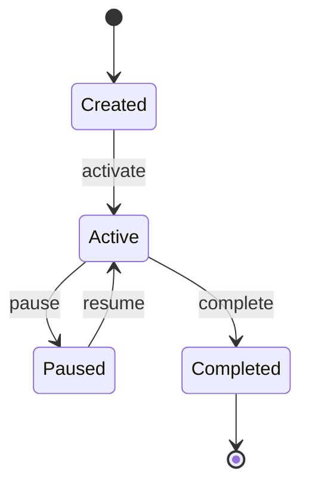
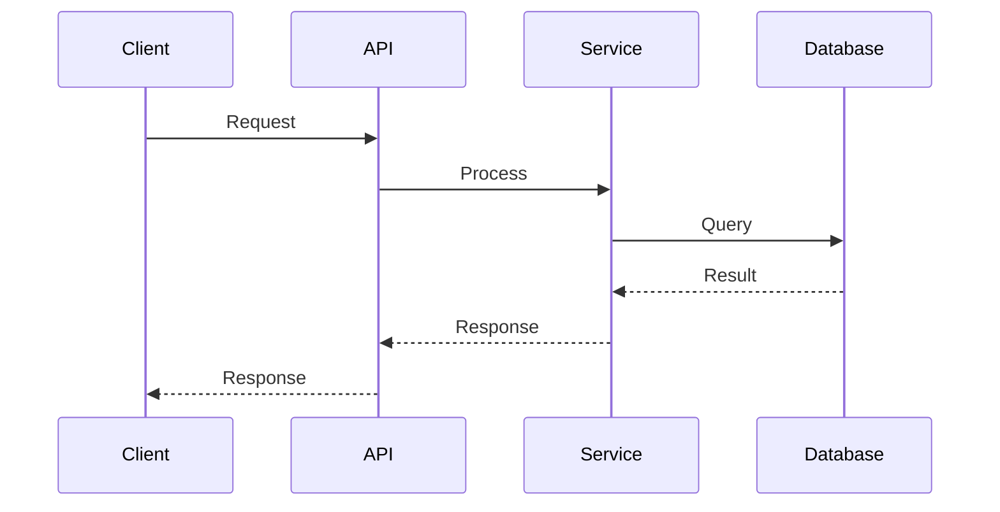

# {{FEATURE_NAME}} - Design

> **Status**: Draft | In Review | Approved
> **Requirements**: [requirements.md](./requirements.md)
> **Last Updated**: {{DATE}}

## Overview

<!-- Brief summary of the design approach -->

## Architecture Overview

<!-- High-level system architecture -->

```mermaid
graph TD
    subgraph "External"
        Client[Client Application]
    end

    subgraph "System Boundary"
        API[API Gateway]
        Service[{{Feature}} Service]
        DB[(Database)]
    end

    Client --> API
    API --> Service
    Service --> DB
```

## Component Design

### {{Component Name}}

**Purpose**: {{brief description}}

**Responsibilities**:
- {{responsibility 1}}
- {{responsibility 2}}

**Dependencies**:
- {{dependency 1}}
- {{dependency 2}}

**Interfaces**:

```typescript
interface {{ComponentName}} {
  // Input
  {{methodName}}(input: {{InputType}}): {{OutputType}};
}
```

### {{Another Component}}

**Purpose**: {{brief description}}

<!-- Repeat for each component -->

## API Design

### {{Endpoint Name}}

**Endpoint**: `{{METHOD}} /api/v1/{{resource}}`

**Description**: {{what this endpoint does}}

**Request**:

| Parameter | Type | Required | Description |
|-----------|------|----------|-------------|
| {{param}} | {{type}} | Yes/No | {{description}} |

```json
{
  "field": "value"
}
```

**Response**:

| Status | Description |
|--------|-------------|
| 200 | Success |
| 400 | Bad Request |
| 401 | Unauthorized |
| 500 | Internal Error |

**Success Response (200)**:
```json
{
  "data": {
    "id": "string",
    "field": "value"
  }
}
```

**Error Response (4xx/5xx)**:
```json
{
  "error": {
    "code": "ERROR_CODE",
    "message": "Human readable message"
  }
}
```

## Data Model

### Entity Relationship Diagram

```mermaid
erDiagram
    {{Entity1}} ||--o{ {{Entity2}} : "has many"
    {{Entity1}} {
        string id PK
        string name
        datetime created_at
        datetime updated_at
    }
    {{Entity2}} {
        string id PK
        string entity1_id FK
        string field
    }
```

### {{Entity}} Schema

| Field | Type | Constraints | Description |
|-------|------|-------------|-------------|
| id | UUID | PK, NOT NULL | Primary key |
| {{field}} | {{type}} | {{constraints}} | {{description}} |
| created_at | TIMESTAMP | NOT NULL | Creation timestamp |
| updated_at | TIMESTAMP | NOT NULL | Last update timestamp |

## State Machine

<!-- If applicable, show state transitions -->



## Sequence Diagrams

### {{Use Case Name}}



## Error Handling

| Error Code | HTTP Status | Description | Resolution |
|------------|-------------|-------------|------------|
| {{CODE}} | {{status}} | {{description}} | {{how to resolve}} |

### Error Response Format

```json
{
  "error": {
    "code": "UNIQUE_ERROR_CODE",
    "message": "User-friendly message",
    "details": {
      "field": "Additional context"
    },
    "trace_id": "For debugging"
  }
}
```

## Security Considerations

### Authentication

<!-- How authentication is handled -->

### Authorization

<!-- How authorization is enforced -->

### Data Protection

<!-- Encryption, PII handling, etc. -->

## Performance Considerations

### Caching Strategy

<!-- What is cached, TTL, invalidation -->

### Optimization Techniques

<!-- Indexes, query optimization, etc. -->

### Scalability

<!-- How the system scales -->

## Migration Plan

<!-- If applicable, steps for data migration -->

### Pre-Migration

- [ ] {{step}}

### Migration Steps

1. {{step 1}}
2. {{step 2}}

### Rollback Plan

1. {{rollback step 1}}
2. {{rollback step 2}}

### Post-Migration Verification

- [ ] {{verification step}}

## Testing Strategy

### Unit Tests

- {{what to unit test}}

### Integration Tests

- {{what to integration test}}

### E2E Tests

- {{what to e2e test}}

## Open Design Questions

<!-- Unresolved design decisions -->

- [ ] {{question 1}}
- [ ] {{question 2}}

## References

- [Requirements](./requirements.md)
- [Proposal](./proposal.md)
- {{external reference}}