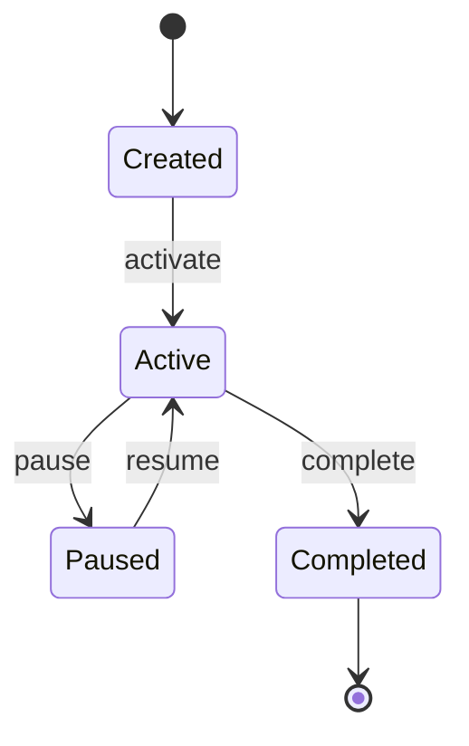
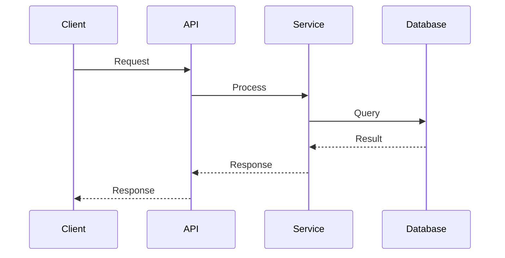
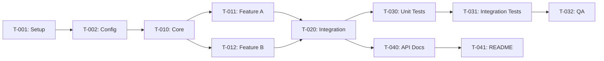

# {{FEATURE_NAME}} - how-to-plan

> **Status**: Draft | In Review | Approved
> **Requirement**: [how-to-requirement.md](./how-to-requirement.md)
> **Last Updated**: {{DATE}}

---

## Design（来自 design.md，粗暴合并保留）

## Overview

<!-- Brief summary of the design approach -->

## Architecture Overview

<!-- High-level system architecture -->

```mermaid
graph TD
    subgraph "External"
        Client[Client Application]
    end

    subgraph "System Boundary"
        API[API Gateway]
        Service[{{Feature}} Service]
        DB[(Database)]
    end

    Client --> API
    API --> Service
    Service --> DB
```

## Component Design

### {{Component Name}}

**Purpose**: {{brief description}}

**Responsibilities**:
- {{responsibility 1}}
- {{responsibility 2}}

**Dependencies**:
- {{dependency 1}}
- {{dependency 2}}

**Interfaces**:

```typescript
interface {{ComponentName}} {
  // Input
  {{methodName}}(input: {{InputType}}): {{OutputType}};
}
```

### {{Another Component}}

**Purpose**: {{brief description}}

<!-- Repeat for each component -->

## API Design

### {{Endpoint Name}}

**Endpoint**: `{{METHOD}} /api/v1/{{resource}}`

**Description**: {{what this endpoint does}}

**Request**:

| Parameter | Type | Required | Description |
|-----------|------|----------|-------------|
| {{param}} | {{type}} | Yes/No | {{description}} |

```json
{
  "field": "value"
}
```

**Response**:

| Status | Description |
|--------|-------------|
| 200 | Success |
| 400 | Bad Request |
| 401 | Unauthorized |
| 500 | Internal Error |

**Success Response (200)**:
```json
{
  "data": {
    "id": "string",
    "field": "value"
  }
}
```

**Error Response (4xx/5xx)**:
```json
{
  "error": {
    "code": "ERROR_CODE",
    "message": "Human readable message"
  }
}
```

## Data Model

### Entity Relationship Diagram

```mermaid
erDiagram
    {{Entity1}} ||--o{ {{Entity2}} : "has many"
    {{Entity1}} {
        string id PK
        string name
        datetime created_at
        datetime updated_at
    }
    {{Entity2}} {
        string id PK
        string entity1_id FK
        string field
    }
```

### {{Entity}} Schema

| Field | Type | Constraints | Description |
|-------|------|-------------|-------------|
| id | UUID | PK, NOT NULL | Primary key |
| {{field}} | {{type}} | {{constraints}} | {{description}} |
| created_at | TIMESTAMP | NOT NULL | Creation timestamp |
| updated_at | TIMESTAMP | NOT NULL | Last update timestamp |

## State Machine

<!-- If applicable, show state transitions -->



## Sequence Diagrams

### {{Use Case Name}}



## Error Handling

| Error Code | HTTP Status | Description | Resolution |
|------------|-------------|-------------|------------|
| {{CODE}} | {{status}} | {{description}} | {{how to resolve}} |

### Error Response Format

```json
{
  "error": {
    "code": "UNIQUE_ERROR_CODE",
    "message": "User-friendly message",
    "details": {
      "field": "Additional context"
    },
    "trace_id": "For debugging"
  }
}
```

## Security Considerations

### Authentication

<!-- How authentication is handled -->

### Authorization

<!-- How authorization is enforced -->

### Data Protection

<!-- Encryption, PII handling, etc. -->

## Performance Considerations

### Caching Strategy

<!-- What is cached, TTL, invalidation -->

### Optimization Techniques

<!-- Indexes, query optimization, etc. -->

### Scalability

<!-- How the system scales -->

## Migration Plan

<!-- If applicable, steps for data migration -->

### Pre-Migration

- [ ] {{step}}

### Migration Steps

1. {{step 1}}
2. {{step 2}}

### Rollback Plan

1. {{rollback step 1}}
2. {{rollback step 2}}

### Post-Migration Verification

- [ ] {{verification step}}

## Testing Strategy

### Unit Tests

- {{what to unit test}}

### Integration Tests

- {{what to integration test}}

### E2E Tests

- {{what to e2e test}}

## Open Design Questions

<!-- Unresolved design decisions -->

- [ ] {{question 1}}
- [ ] {{question 2}}

## References

- [Requirement](./how-to-requirement.md)
- {{external reference}}

---

## Tasks（来自 tasks.md，粗暴合并保留）

> **状态**: 未开始 | 进行中 | 已完成
> **开始日期**: {{DATE}}
> **目标完成日期**: {{DATE}}

## 🎛️ 执行模式 (AI Agent 必读)

**支持三种执行模式，用户可自由选择：**

| 模式 | 触发词 | 行为 |
|------|--------|------|
| **单步模式** (默认) | "开始执行"、"start" | 执行一个任务，等待确认，重复 |
| **批量模式** | "全部执行"、"一口气执行"、"batch" | 连续执行所有任务，最后汇报 |
| **阶段模式** | "执行第一阶段"、"execute setup" | 执行一个阶段的任务，然后等待 |

**所有模式必须遵守：**
1. ✅ 严格按顺序执行 - 从第一个 `- [ ]` 开始
2. ✅ 检查依赖 - 执行前确认依赖任务已完成 (`- [x]`)
3. ✅ 更新状态 - 完成后将 `- [ ]` 改为 `- [x]`
4. ✅ 报告进度 - 显示 (N/Total)
5. ✅ 遇错即停 - 出错时立即停止，等待用户指示

**禁止行为：**
- ❌ 跳过任务
- ❌ 不按顺序执行
- ❌ 执行任务列表之外的工作
- ❌ 出错后继续执行

## 概览

| Phase | Tasks | Completed | Progress |
|-------|-------|-----------|----------|
| Setup | {{n}} | 0 | 0% |
| Implementation | {{n}} | 0 | 0% |
| Testing | {{n}} | 0 | 0% |
| Documentation | {{n}} | 0 | 0% |
| **Total** | **{{n}}** | **0** | **0%** |

## Task Breakdown

### Phase 1: Setup

- [ ] **T-001**: {{task description}}
  - **Complexity**: Low
  - **Files**: `{{path/to/file}}`
  - **Dependencies**: None
  - **Notes**: {{additional context}}

- [ ] **T-002**: {{task description}}
  - **Complexity**: Low
  - **Files**: `{{path/to/file}}`
  - **Dependencies**: T-001
  - **Notes**:

### Phase 2: Core Implementation

- [ ] **T-010**: {{task description}}
  - **Complexity**: Medium
  - **Files**:
    - `{{path/to/file1}}`
    - `{{path/to/file2}}`
  - **Dependencies**: T-002
  - **Notes**:

- [ ] **T-011**: {{task description}}
  - **Complexity**: High
  - **Files**: `{{path/to/file}}`
  - **Dependencies**: T-010
  - **Notes**:

- [ ] **T-012**: {{task description}}
  - **Complexity**: Medium
  - **Files**: `{{path/to/file}}`
  - **Dependencies**: T-010
  - **Notes**:

### Phase 3: Integration

- [ ] **T-020**: {{task description}}
  - **Complexity**: Medium
  - **Files**: `{{path/to/file}}`
  - **Dependencies**: T-011, T-012
  - **Notes**:

### Phase 4: Testing

- [ ] **T-030**: Write unit tests for {{component}}
  - **Complexity**: Medium
  - **Files**: `{{path/to/test/file}}`
  - **Dependencies**: T-020
  - **Notes**: Target coverage: {{percentage}}%

- [ ] **T-031**: Write integration tests
  - **Complexity**: Medium
  - **Files**: `{{path/to/test/file}}`
  - **Dependencies**: T-030
  - **Notes**:

- [ ] **T-032**: Manual QA testing
  - **Complexity**: Low
  - **Files**: N/A
  - **Dependencies**: T-031
  - **Notes**: Test cases: {{list}}

### Phase 5: Documentation

- [ ] **T-040**: Update API documentation
  - **Complexity**: Low
  - **Files**: `docs/{{file}}.md`
  - **Dependencies**: T-020
  - **Notes**:

- [ ] **T-041**: Update README/changelog
  - **Complexity**: Low
  - **Files**: `README.md`, `CHANGELOG.md`
  - **Dependencies**: T-040
  - **Notes**:

## Progress Tracking

| Task | Status | Assignee | Started | Completed | Notes |
|------|--------|----------|---------|-----------|-------|
| T-001 | ⏳ Pending | | | | |
| T-002 | ⏳ Pending | | | | |
| T-010 | ⏳ Pending | | | | |
| T-011 | ⏳ Pending | | | | |
| T-012 | ⏳ Pending | | | | |
| T-020 | ⏳ Pending | | | | |
| T-030 | ⏳ Pending | | | | |
| T-031 | ⏳ Pending | | | | |
| T-032 | ⏳ Pending | | | | |
| T-040 | ⏳ Pending | | | | |
| T-041 | ⏳ Pending | | | | |

**Legend**:
- ⏳ Pending
- 🔄 In Progress
- ✅ Done
- ❌ Blocked
- ⏸️ On Hold

## Dependency Graph



## Blockers

<!-- Track any blockers encountered -->

| Blocker | Blocking Tasks | Raised | Owner | Status | Resolution |
|---------|----------------|--------|-------|--------|------------|
| {{blocker description}} | T-XXX | {{date}} | {{name}} | Open/Resolved | {{resolution}} |

## Change Log

<!-- Track significant changes to the task plan -->

| Date | Change | Reason |
|------|--------|--------|
| {{date}} | Initial task breakdown | |
| {{date}} | {{change}} | {{reason}} |

## Completion Checklist

Before marking as complete:

- [ ] All tasks marked as Done
- [ ] All tests passing
- [ ] Code reviewed
- [ ] Documentation updated
- [ ] Changelog updated
- [ ] Stakeholders notified
- [ ] Spec archived to `.spec-flow/archive/{{feature-name}}/`
