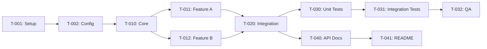

# {{FEATURE_NAME}} - 任务清单

> **状态**: 未开始 | 进行中 | 已完成
> **设计文档**: [design.md](./design.md)
> **开始日期**: {{DATE}}
> **目标完成日期**: {{DATE}}

---

## 🎛️ 执行模式 (AI Agent 必读)

**支持三种执行模式，用户可自由选择：**

| 模式 | 触发词 | 行为 |
|------|--------|------|
| **单步模式** (默认) | "开始执行"、"start" | 执行一个任务，等待确认，重复 |
| **批量模式** | "全部执行"、"一口气执行"、"batch" | 连续执行所有任务，最后汇报 |
| **阶段模式** | "执行第一阶段"、"execute setup" | 执行一个阶段的任务，然后等待 |

**所有模式必须遵守：**
1. ✅ 严格按顺序执行 - 从第一个 `- [ ]` 开始
2. ✅ 检查依赖 - 执行前确认依赖任务已完成 (`- [x]`)
3. ✅ 更新状态 - 完成后将 `- [ ]` 改为 `- [x]`
4. ✅ 报告进度 - 显示 (N/Total)
5. ✅ 遇错即停 - 出错时立即停止，等待用户指示

**禁止行为：**
- ❌ 跳过任务
- ❌ 不按顺序执行
- ❌ 执行任务列表之外的工作
- ❌ 出错后继续执行

---

## 概览

| Phase | Tasks | Completed | Progress |
|-------|-------|-----------|----------|
| Setup | {{n}} | 0 | 0% |
| Implementation | {{n}} | 0 | 0% |
| Testing | {{n}} | 0 | 0% |
| Documentation | {{n}} | 0 | 0% |
| **Total** | **{{n}}** | **0** | **0%** |

## Task Breakdown

### Phase 1: Setup

- [ ] **T-001**: {{task description}}
  - **Complexity**: Low
  - **Files**: `{{path/to/file}}`
  - **Dependencies**: None
  - **Notes**: {{additional context}}

- [ ] **T-002**: {{task description}}
  - **Complexity**: Low
  - **Files**: `{{path/to/file}}`
  - **Dependencies**: T-001
  - **Notes**:

### Phase 2: Core Implementation

- [ ] **T-010**: {{task description}}
  - **Complexity**: Medium
  - **Files**:
    - `{{path/to/file1}}`
    - `{{path/to/file2}}`
  - **Dependencies**: T-002
  - **Notes**:

- [ ] **T-011**: {{task description}}
  - **Complexity**: High
  - **Files**: `{{path/to/file}}`
  - **Dependencies**: T-010
  - **Notes**:

- [ ] **T-012**: {{task description}}
  - **Complexity**: Medium
  - **Files**: `{{path/to/file}}`
  - **Dependencies**: T-010
  - **Notes**:

### Phase 3: Integration

- [ ] **T-020**: {{task description}}
  - **Complexity**: Medium
  - **Files**: `{{path/to/file}}`
  - **Dependencies**: T-011, T-012
  - **Notes**:

### Phase 4: Testing

- [ ] **T-030**: Write unit tests for {{component}}
  - **Complexity**: Medium
  - **Files**: `{{path/to/test/file}}`
  - **Dependencies**: T-020
  - **Notes**: Target coverage: {{percentage}}%

- [ ] **T-031**: Write integration tests
  - **Complexity**: Medium
  - **Files**: `{{path/to/test/file}}`
  - **Dependencies**: T-030
  - **Notes**:

- [ ] **T-032**: Manual QA testing
  - **Complexity**: Low
  - **Files**: N/A
  - **Dependencies**: T-031
  - **Notes**: Test cases: {{list}}

### Phase 5: Documentation

- [ ] **T-040**: Update API documentation
  - **Complexity**: Low
  - **Files**: `docs/{{file}}.md`
  - **Dependencies**: T-020
  - **Notes**:

- [ ] **T-041**: Update README/changelog
  - **Complexity**: Low
  - **Files**: `README.md`, `CHANGELOG.md`
  - **Dependencies**: T-040
  - **Notes**:

## Progress Tracking

| Task | Status | Assignee | Started | Completed | Notes |
|------|--------|----------|---------|-----------|-------|
| T-001 | ⏳ Pending | | | | |
| T-002 | ⏳ Pending | | | | |
| T-010 | ⏳ Pending | | | | |
| T-011 | ⏳ Pending | | | | |
| T-012 | ⏳ Pending | | | | |
| T-020 | ⏳ Pending | | | | |
| T-030 | ⏳ Pending | | | | |
| T-031 | ⏳ Pending | | | | |
| T-032 | ⏳ Pending | | | | |
| T-040 | ⏳ Pending | | | | |
| T-041 | ⏳ Pending | | | | |

**Legend**:
- ⏳ Pending
- 🔄 In Progress
- ✅ Done
- ❌ Blocked
- ⏸️ On Hold

## Dependency Graph

## Blockers

<!-- Track any blockers encountered -->

| Blocker | Blocking Tasks | Raised | Owner | Status | Resolution |
|---------|----------------|--------|-------|--------|------------|
| {{blocker description}} | T-XXX | {{date}} | {{name}} | Open/Resolved | {{resolution}} |

## Change Log

<!-- Track significant changes to the task plan -->

| Date | Change | Reason |
|------|--------|--------|
| {{date}} | Initial task breakdown | |
| {{date}} | {{change}} | {{reason}} |

## Completion Checklist

Before marking as complete:

- [ ] All tasks marked as Done
- [ ] All tests passing
- [ ] Code reviewed
- [ ] Documentation updated
- [ ] Changelog updated
- [ ] Stakeholders notified
- [ ] Spec archived to `.spec-flow/archive/{{feature-name}}/`